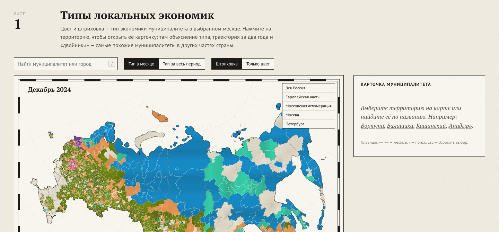

# Атлас локальных экономик

Типология 2016 российских муниципалитетов по структуре потребительских трат жителей
за 2023–2024 годы. Работа на конкурс СберИндекса, направление «Кластеризация».

Атлас: https://z1nex.online/atlas/



Каждый муниципалитет — узел динамической сети. Атрибуты узла — структура трат по
категориям, уровень трат относительно страны и ритм трат в году; рёбра — экономическая
близость. Кластеризация учитывает признаки и сеть вместе. Получилось семь типов, от центра
Москвы до «ядра» из тысячи сельских и малогородских районов. Помесячная модель показывает,
кто из муниципалитетов за два года устойчиво сменил тип.

## Что внутри

| Раздел | Где | Коротко |
|---|---|---|
| Признаки | `src/atlas/features.py` | CLR-преобразование долей относительно медианы страны в том же месяце, уровень трат, сезонность, летний пик, волатильность |
| Сеть | `src/atlas/graphs.py` | 7 правил рёбер: сходство профилей, корреляция отклонений, лаговая корреляция, DTW, дороги, гибрид, мультиплекс |
| Методы | `src/atlas/methods.py`, `dmon.py` | k-средних, гауссова смесь, Уорд, спектральная по сети, Leiden, спектральная на признаках и сети, SEFNAC, DMoN |
| Индексы | `src/atlas/icvi.py`, `rank.py` | SW, CH, S_Dbw, AVI, AVU, MQ; сведение мест по Кемени, Борда и Коупленду |
| Динамика | `src/atlas/temporal.py` | Скрытая марковская модель помесячных типов, блочный перестановочный нуль, мультислойный Leiden, события кластеров |
| Интерпретация | `src/atlas/interpret.py`, `external.py` | Формальные понятия (FCA) для каждого типа, проверка на данных Росстата |
| Атлас | `site/` | Статический сайт на D3, данные собирает `atlas export` |
| Отчёт | `report/` | Методологический отчёт, Typst |

Все параметры — в `configs/default.yaml`, названия и описания типов — в `configs/types.yaml`.

## Запуск

Нужны Python 3.12+ и `bsdtar` (есть в macOS; в Linux — пакет `libarchive-tools`).

```
make setup     # виртуальное окружение и зависимости
make data      # скачать данные и сверить контрольные суммы
make run       # весь расчёт, около 5 минут на ноутбуке
make site      # данные для атласа в site/data
make serve     # атлас на http://localhost:8765
make test
```

Или без make:

```
python3 -m venv .venv
.venv/bin/pip install -r requirements-dmon.txt -r requirements-dev.txt
PYTHONPATH=src .venv/bin/python -m atlas fetch
PYTHONPATH=src .venv/bin/python -m atlas run
PYTHONPATH=src .venv/bin/python -m atlas export
```

`requirements.txt` — без PyTorch; он нужен только для DMoN (`requirements-dmon.txt`).
Если без DMoN, уберите `dmon` из `clustering.methods` в конфиге.

У sberbank.com сертификат выдан российским удостоверяющим центром. Если система его
не знает, `atlas fetch --no-verify-tls` скачает файлы без проверки TLS; целостность всё равно
проверяется по sha256.

`atlas run` создаёт папку outputs с таблицами (в репозиторий она не входит, собирается за 5 минут):

| Файл | Содержание |
|---|---|
| `grid.csv` | 342 разбиения «метод × сеть × k» и все индексы, в том числе на каждой сети отдельно |
| `ranking.csv`, `concordance.csv` | Места по трём правилам внутри каждого k, согласие индексов |
| `stability.csv` | ARI на подвыборках 80% и при смене seed |
| `graphs.csv`, `graph_sensitivity.csv` | Свойства сетей и их зависимость от числа соседей |
| `ablation.csv` | Итоговый метод на разных наборах признаков |
| `types.csv`, `changes.csv`, `boundary.csv` | Итоговые типы, устойчивые смены типа, пограничные МО |
| `dynamics.json`, `interpretation.json` | Динамика, FCA, внешняя проверка |

## Главные результаты

- Итоговая модель — спектральная кластеризация на смеси ядра признаков и гибридной сети
  (70% сходства профилей, 30% близости по дорогам), k = 7. По правилу Кемени она первая
  при 8 значениях k из 9; ARI на подвыборках 0,92, при смене seed 1,00.
- Семь — наибольшее число типов, которое держится устойчиво: при k = 8 ARI падает до 0,74.
  Половина страны образует сплошное ядро без устойчивого внутреннего деления.
- Индексы качества согласуются слабо: конкордация Кендалла W от 0,33 до 0,50. Графовые индексы
  зависят от сети, на которой их считать, поэтому метод оценивается только на сетях,
  построенных из других данных, чем использовал он сам.
- Типы связаны с переменными, не входившими в модель: Крайний Север — V Крамера 0,78,
  численность населения — η² 0,42, доступность рынков — η² 0,56. С регионами совпадение
  умеренное (NMI 0,32): в 64 регионах из 73 встречается больше одного типа.
- Устойчиво сменили тип 37 МО; при перемешанных месяцах получается 15 ± 7.
  Общий для страны рост маркетплейсов в 2024 году сменой типа не считается: доли берутся
  относительно медианы страны в том же месяце.

## Ограничения

Данные — модельные оценки безналичных трат; доля наличных в регионах разная. 174 МО
с неполными рядами в модель не вошли. Два года — мало, чтобы отделить тренд от колебаний.
Внутригородские территории Москвы и Петербурга — отдельные МО, хотя жители тратят
деньги по всему городу.

## Данные и лицензии

- Потребительские расходы, индекс доступности рынков, связи между МО и справочник МО —
  Лаборатория СберИндекс, CC BY-SA 4.0,
  https://sberindex.ru/ru/research/data-sense-opisanie-nabora-dannikh-khakatona-sberindeksa-po-munitsipalnim-dannim
- Численность населения по МО на 1 января 2024 года, районы Крайнего Севера, моногорода —
  Росстат, бюллетень «Численность населения Российской Федерации по муниципальным образованиям».

Код — MIT (`LICENSE`). Производные данные атласа и результаты расчёта распространяются
на условиях CC BY-SA 4.0.
